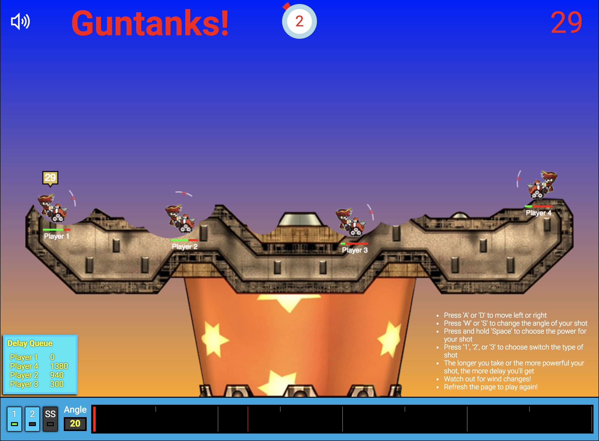

# Guntanks!

[Live Site!](https://masag0.github.io/Guntanks/)

## Overview
Guntanks! is a simplified clone of popular turn based tank games like Worms and Gunbound that was designed and implemented in one week using vanilla JavaScript, HTML5, and CSS3. No outside libraries were used. It has a simple 2D physics engine, destructible terrain, user controlled tanks, artillery, a delay queueing system, and wind that affects the trajectory of projectiles.



## Features
* Tanks that can move, shoot, and have health
* 3 different types of shots
* Destructible Terrain
* Simple 2D physics engine for projectile motion and wind
* Artillery that can interact with the terrain and tanks
* Wind that affects the trajectories of artillery
* Background music and SFX

## How to Play
* Play locally with 2 or 4 players.
* On your turn, you have 30 seconds until your turn ends.
* Move with 'A' or 'D'.
* Adjust the angle of your shot with 'W' or 'S'
* Select which shot you want to use with '1', '2', or '3' or by clicking on the buttons.
* Adjust the power of your shot by pressing and holding 'Space'. Let go of 'Space' to fire your shot.
* See the power of your previous shot as a red indicator on the power bar.
* Watch out for wind!
* Refresh the page to play again!

## Details

### Tanks
* Tanks start with 1000 health.
* A tank will die when its health is reduced to 0 or it falls off of the terrain.
* Tanks can move a limited distance during their turn and climb terrain. Some terrain is too steep to climb.

### Delay
* Every second you take during your turn adds to your delay which determines when your next turn will happen.
* Firing shots also adds to your delay.
* Shot 1 adds 750, Shot 2 adds 900, and your Special Shot (SS) will add 1330 to your delay.
* The current turn order and delay for each player is displayed in the Delay Queue.

### Shells
* A tank can fire 3 different types of shells.
* Shot 1 is the most basic type of shell. It does 130 damage, has a moderate explosion radius, and is lighter than the other shells.
* Shot 2 does 240 damage and has a small explosion radius.
* SS does 350 damage and has a large explosion radius. It has a 3 turn cooldown time.

### Terrain
* Terrain can be destroyed by shooting it with shells.
* Different shells destroy more or less terrain.
* If all the terrain under a tank is destroyed, the tank will be eliminated.

### Wind
* The wind indicator displays the wind speed and angle.
* Wind can come at any angle and a speed between 0 and 25.
* Wind will affect the trajectory of shots.
* Wind will change every 3 rounds to a random speed and angle.
* Each shell type has a different weight and will be affected by the wind differently

## Implementation

### Destructible Terrain
* The destructible terrain was created by layering several HTML5 canvases on top of each other, with each one rendering specific components of the game, like UI info, the tanks and shells, and the terrain.
* The game then saves the state of the terrain canvas at every frame and checks for collisions with shells to determine whether a hole should be made in the terrain.
```javascript
  //inside render() for the terrain
  if (this.data) this.ctx.putImageData(this.data, 0 , 0);
  this.can.getContext('2d').drawImage(this.buffer, 0, 0);
  if (this.shell) {
    this.ctx.globalCompositeOperation = 'destination-out';

    this.ctx.strokeStyle = "#000";
    this.ctx.beginPath();
    this.ctx.arc(this.shell.x, this.shell.y, this.shell.explosionRadius, 0, Math.PI*2);
    this.ctx.fill();
    this.shell = null;
    this.data = this.ctx.getImageData(0,0,this.img.width, this.img.height);
    this.ctx.globalCompositeOperation = 'source-over';
  }
```

### Projectile Motion
* The game uses a simple physics engine that implements gravity, acceleration, velocity, and wind resistance to provide projectile motion for the shells fired by tanks.
* Formulae used to calculate the x and y coordinates of shells as they fly through the air after factoring in the wind:
```javascript
  this.x += this.xVel + 0.02*this.windSpeed*Math.cos(this.windAngle*Math.PI/180)*this.time; //x coordinate
  this.y += this.yVel + 0.5*this.weight*this.time*this.time - 0.02*this.windSpeed*Math.sin(this.windAngle*Math.PI/180)*this.time; //y-coordinate
```

### Collision Detection
* Collisions between shells and terrain, shells and tanks, and tanks and terrain were all handled separately.
* Shell and tank collisions were handled by calculating the distance between the two objects' centers
* Tank and terrain collision was handled by using transparent pixel detection, where the air is represented by transparent black pixels on the terrain canvas and all non-transparent pixels are solid.
* Each tank has a hitbox and sprite, but only the hitbox is taken into consideration for collisions. The bottom, left, and right edges of the hitbox were used to determine whether the tank has ground underneath it and
whether the tank is on an incline or decline.
* Function for testing collisions between tank and terrain or shell and terrain:
```javascript
  hitTest (x, y, width, height) { //return true if collision
    let array = [];
    for (let i = 0; i < width; i++) {
      for (let j = 0; j < height; j++) {
        array.push([x+i, y+j]);
      }
    }

    for(let i = 0; i < array.length; i++) {
      if (
        this.ctxTerrain.getImageData(array[i][0],array[i][1],1,1).data[0] != 0 ||
        this.ctxTerrain.getImageData(array[i][0],array[i][1],1,1).data[1] != 0 ||
        this.ctxTerrain.getImageData(array[i][0],array[i][1],1,1).data[2] != 0 ||
        this.ctxTerrain.getImageData(array[i][0],array[i][1],1,1).data[3] != 0
      ) {
        return true;
      }
    }
    return false;
  }
```
* Using the function above inside of the move function to determine whether a tank is on an incline and whether it should climb:

```javascript
  move (velX = 0, dir) {
    if (dir) { //moving
      this.distance++;
      if (dir == 'left' && !this.hitTest(this.x-1, this.y, 1, this.height/1.5)) { //tank facing left, testing left bottom edge
        this.face = 'left';
        if (this.distance < this.maxDistance) {
          this.x += velX;
          if (this.hitTest(this.x, this.y+this.height-1, this.width, 1)) {
            this.y -= 1;

          }
        }
      }
    //more code for if the tank is facing right
    }
  }
```
* The same transparent pixel detection was used to handle shell and terrain collisions

## Future Work
* Tank rotation depending on angle of incline or decline
* More types of tanks and shells
* Add AI
* More weather effects
* Sprites for shells
* Online multiplayer with lobby
* More SFX


